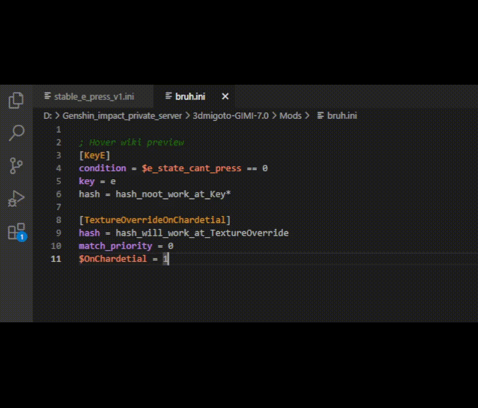

# Attention
The compilation settings related to TS have not been implemented yet.
Therefore, modifying the extension code at the project root may not change anything.

And __**PLEASE**__ look [convertYamlJson.js](./building_tools/convertYamlJson.js) first.
That is a script can convert between YAML and JSON.
Builded this because YAML is more readable them JSON.
And default disable on extension launch **NOW**.
**It Will Override tmLanguage.json Which One Use On GIMI ini Every Debug Execute.**
You can change its default behavior in [launch.json](./.vscode/launch.json)'s `preLaunchTask`
And script running config is in [tasks.json](./.vscode/tasks.json)

---

## What is GIMI ini extension 

A famous anime game mod ini config file support extension

## Features

This is a simple extension so not have more features
 - [x] Highlighting
 - [x] Keyword range check
 - [ ] Simple keyword explanation
 - [ ] Error checking

Keyword explanation preview, Default disabled

Static highlight preview, Default enabled

> Tip: No more image or animations from now.

## Requirements

Don't be rude
Don't make a big deal about it
Don't jump face with the official

## Extension Settings

Hnuh?

<!-- Include if your extension adds any VS Code settings through the `contributes.configuration` extension point.

For example:

This extension contributes the following settings:

* `myExtension.enable`: Enable/disable this extension.
* `myExtension.thing`: Set to `blah` to do something. -->

## Known Issues

A piece of sh---

## Release Notes

No release version until now.

### 0.0.1

Initial builded of ...

### 0.1.0

Very huge changes. They have tow types.
 1. Feasibility testing in progress:
   - Keyword range checking.
   - Keyword meaning hover tips.
 2. Already working:
   - The rules of tmLanguage has been change,
     including but not limited to nesting, area checking, possible range guessing.

I need some color style suggestions, and tmLanguage token namespace regularization...

---

### Participants

 - SinsOfSeven 
 - LeoMods 
 - !someone name has 63B long? 

<!-- ## Working with Markdown

You can author your README using Visual Studio Code. Here are some useful editor keyboard shortcuts:

* Split the editor (`Cmd+\` on macOS or `Ctrl+\` on Windows and Linux).
* Toggle preview (`Shift+Cmd+V` on macOS or `Shift+Ctrl+V` on Windows and Linux).
* Press `Ctrl+Space` (Windows, Linux, macOS) to see a list of Markdown snippets.

## For more information

* [Visual Studio Code's Markdown Support](http://code.visualstudio.com/docs/languages/markdown)
* [Markdown Syntax Reference](https://help.github.com/articles/markdown-basics/)

**Enjoy!** -->
